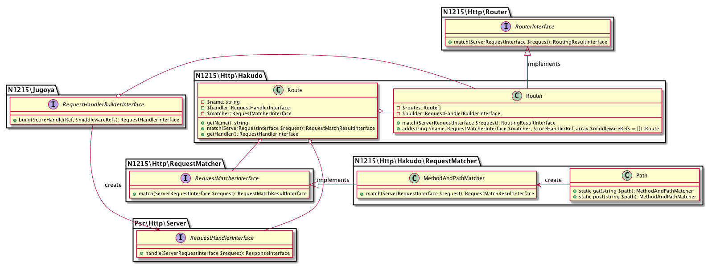

# Hakudo（白道）🌕

[](https://packagist.org/packages/n1215/hakudo)
[](https://packagist.org/packages/n1215/hakudo)
[](https://scrutinizer-ci.com/g/n1215/hakudo/build-status/master)
[](https://scrutinizer-ci.com/g/n1215/hakudo/?branch=master)
[](https://scrutinizer-ci.com/g/n1215/hakudo/?branch=master)

A PSR7 / PSR-15 compatible HTTP router using [n1215/http-router](https://github.com/n1215/http-router), [n1215/http-request-matcher](https://github.com/n1215/http-request-matcher) and [n1215/jugoya]( [n1215/http-request-matcher](https://github.com/n1215/jugoya)).

## Usage

```php
<?php
use Psr\Http\Message\ServerRequestInterface;
use Psr\Http\Message\ResponseInterface;
use N1215\Http\Router\RoutingErrorInterface;
use Psr\Http\Server\RequestHandlerInterface;
use Psr\Http\Server\MiddlewareInterface

// 1. Implement RoutingErrorResponderInterface.
class YourRoutingErrorResponder implements N1215\Http\Router\RoutingErrorResponderInterface
{
    public function respond(ServerRequestInterface $request, RoutingErrorInterface $error): ResponseInterface
    {
        // implement
    }
}

// 2. Implement PSR-11 Container
class YourContainer implements Psr\Container\ContainerInterface
{
    public function get($id)
    {
        // implement
    }

    public function has($id) 
    {
        // implement
    }
}

// 3. Implement PSR-15 RequestHandler
class YourHandler implements RequestHandlerInterface
{
    public function handle(ServerRequestInterface $request): ResponseInterface 
    {
        $id = $request->getAttribute('id'); // matched route parameters becomes attributes.
        // implement
    }
}

// 4. Implement PSR-15 Middleware
class YourMiddleware implements MiddlewareInterface
{
    public function process(ServerRequestInterface $request, RequestHandlerInterface $handler): ResponseInterface
    {
        // implement
    }
}

// 5. register handler and middleware to the container
$container = new YourContainer();
$container->bind(YourHandler::class, function () { return new YourHandler(); });
$container->bind(YourMiddleware::class, function () { return new YourMiddleware(); });

// 6. create Router instance
$router = new N1215\Hakudo\Router(
    N1215\Jugoya\LazyRequestHandlerBuilder::fromContainer($container)
);

// 7. add routes
use N1215\Hakudo\RequestMatcher\Path;
$router->add(
    Path::get('|/resources/(?<resource_name>[a-z_]+)/(?<id>[0-9]+)|'), // you can use any other RequestMatcher instance.
    YourHandler::class, // you can use same signature closure or RequestHandler instance instead of RequestHandler's container entry name.
    [YourMiddleware::class] // you can use same signature closure or Middleware instance instead of Middleware's container entry name.
)->name('route_name');

// 8. create RoutingHandler
$routingHandler = new N1215\Http\Router\RoutingHandler(
    $router,
    new YourRoutingErrorResponder()
);

// 9. Use RoutingHandler as an implementation of PSR-15 server request handler.
/** @var ServerRequestInterface $request */
/** @var ResponseInterface $response */
$response = $routingHandler->handle($request);

```

## Class diagrams

### Hakudo


### RouterInterface


### RequestMatcherInterface


### Jugoya


## License
The MIT License (MIT). Please see [LICENSE](LICENSE) for more information.
